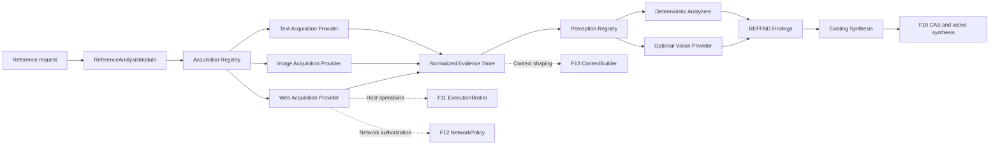

# RA7-A — Reference Acquisition & Perception Architecture Audit

审计日期：2026-08-09  
审计范围：R0-R6 已落地的 Reference Analysis、Browser、F11/F12/F13 Runtime 与 Security 边界  
审计性质：仅审计与设计，不实施生产代码

## Executive Summary

RA7-A 结论：**PASS**。

当前系统已经有一个可工作的、追加式的 Reference Analysis 骨架：`text_description`、`image`、`web_page` 三类适配器可以进入现有 `ReferenceAnalysisModule`，并通过规范化、证据清单、Finding、Synthesis 与 F10 CAS 接入既有流程。R0-R6 最新历史回归为 `690 passed, 5 skipped, 113 subtests`；5 个跳过项与 Docker daemon 不可用有关。

但当前“采集”和“感知”仍未真正启用：

- Browser Harness 是 Evaluator 侧验收工具，不是 Reference Acquisition Provider。
- 正式 Vision Provider、模型调用和感知能力尚不存在。
- `image` 适配器只做文件安全性与结构元数据检查，语义和布局分析明确为 unavailable。
- `web_page` 适配器只做 URL 规范化与安全校验，网络获取明确为 `NETWORK_ACQUISITION_DEFERRED`。

因此建议的边界是：

```text
Acquisition Provider
  -> immutable raw/normalized artifact
  -> deterministic evidence
  -> optional Perception Provider
  -> REFFND findings
  -> existing Reference Synthesis
```

RA7-A 不应新增第四个 Agent，也不应把 Browser、Vision 或外部网络直接塞进现有适配器。RA7-B 只有在用户明确授权、依赖与安全策略准备完成、并先落地最小契约测试后才能开始。

## Current Capability Inventory

| 能力 | 当前状态 | 可复用资产 | 明确缺口 |
|---|---|---|---|
| 文本 Reference | READY | 文本适配器、UTF-8 读取、大小限制、SHA-256、确定性分析 | 无需在 RA7-A 改动 |
| 本地图像 Reference | READY_WITH_LIMITATIONS | PNG/JPG/JPEG/WebP 魔数、大小、哈希、PNG 尺寸 | 解码、像素预算、EXIF/压缩炸弹检查、语义感知 |
| Web URL Reference | READY_WITH_LIMITATIONS | HTTPS 与主机校验、规范 URL、拒绝私网/敏感查询 | 网络抓取、重定向链、DOM、Computed Style、截图 |
| Browser Harness | READY_WITH_LIMITATIONS | Evaluator-only policy、步骤记录、DOM 状态读取、截图、控制台/失败请求记录 | 未接入 Reference Acquisition、F11/F12、完整 DOM/样式/多 viewport |
| Vision | NOT_AVAILABLE | `visual_semantic_analysis: unavailable` 的显式结果路径 | Provider、模型调用、版本、配额、证据与降级协议 |
| F11 Execution | READY | ExecutionBroker、Tool Call、结果哈希、路径策略 | BrowserBroker 当前未经过 ExecutionBroker |
| F12 Network | READY_WITH_LIMITATIONS | NetworkPolicy、重定向授权接口、私网/metadata 拦截 | 浏览器导航尚未强制经过它 |
| F13 Context | READY | ContextBuilder、角色/模块 subject、原始证据隔离 | Acquisition/Perception 专用上下文预算与裁剪策略 |

现有能力来自 R0-R6 报告、当前 `runtime/reference_analysis`、`runtime/browser`、`runtime/execution`、`runtime/security` 与 `runtime/context`。本报告不把历史设计预览当作实现证据。

## Current Browser Capability

`runtime/browser/adapter.py` 的协议当前覆盖：启动、导航、点击、填充、选择、键盘、等待、读取文本、DOM 状态、URL、截图、控制台错误、失败请求和关闭。`PlaywrightBrowserAdapter` 使用延迟导入的 Playwright，并以 headless Chromium 为目标实现。

当前限制：

1. 环境中未安装 Playwright Python 模块；Docker engine 也不可用，因此不能把“接口存在”当成“本轮已有真实采集能力”。
2. Browser Policy 默认拒绝，只允许 Evaluator 使用 `browser.access`。
3. BrowserBroker 直接校验 Session、Role Run、Lease 和 Capability，没有走 `ExecutionBroker`，也没有为每个浏览器操作创建标准 Tool Call 事件。
4. 当前 Harness 没有完整 DOM snapshot、交互元素清单、几何盒、页面标题、Computed Style、网络空闲/稳定性判定、viewport/device scale/UA 配置。
5. 截图可以记录引用，但当前浏览器证据记录不负责内容哈希。

**审计判定**：Browser Harness 可以作为未来 Web Acquisition 的底层执行器候选，但当前不能直接充当 Reference Acquisition；Evaluator 业务语义和 Acquisition 语义必须通过不同的上层契约隔离。

## Current Vision Capability

当前没有正式 Vision Provider、模型 Invocation、Provider Registry 条目、模型版本记录、超时/成本预算或视觉证据 schema。R2 image analyzer 只返回结构化安全元数据，并把语义分析标记为 unavailable；R6 进一步规定，视觉绑定在能力不可用时必须 BLOCKED，而不能伪造 PASS。

因此：

- 当前 Vision 不是 model capability、tool capability 或 provider capability 中的任何已启用项；对 Reference Analysis 来说应视为 **not available**。
- 主机或浏览器能“看到”一张图片，不等于系统已经产生了可审计的 Vision Finding。
- 不能在 RA7-A 中通过临时截图、临时 API 调用或未登记模型把 Vision 偷渡进运行时。

## Current Image Capability

当前 `image` 适配器可读取模块允许的本地文件，执行大小限制、后缀与魔数检查、SHA-256 和 PNG 尺寸解析，并返回 `NormalizedReference`。当前声明的 semantic/layout 能力为 unavailable。

它适合做“文件是否存在、是否像支持的图像、大小与哈希是什么”的 deterministic acquisition evidence，不适合做“图片表达了什么、页面布局是什么、视觉是否相似”的 perception。

建议未来仍保持两步：

```text
ImageAcquisitionProvider: bytes -> immutable image artifact + metadata
ImagePerceptionProvider: image artifact -> typed findings + provider provenance
```

在启用解码前必须增加最大像素数、解压后内存预算、动图帧数/时长限制，并明确 EXIF、颜色空间和透明度的处理规则。

## Current Web Capability

当前 `web_page` 适配器执行 URL 规范化与安全检查：只接受允许的 scheme，拒绝 localhost、metadata 等主机，拒绝私网地址及敏感查询信息，并返回 URL metadata。配置中 `fetch_enabled: false`，状态为 `NETWORK_ACQUISITION_DEFERRED`。

它目前不能：

- 发起 HTTP 请求或浏览器导航；
- 跟踪并记录 redirect chain；
- 获取 HTML、DOM、Computed Style、截图或网络/控制台证据；
- 判断页面稳定、记录 viewport 或产生可复现网页快照。

结论：Web URL 现在是“已登记、已校验的来源”，不是“已采集的网页证据”。

## Existing R2 Adapter Architecture

R2 已经建立了正确的初始分层：

```text
ReferenceAnalysisModule
  -> adapter.normalize()
  -> evidence record
  -> analyzer.analyze()
  -> findings
  -> synthesis
  -> append-only artifact store
  -> F10 CAS/state transition
```

当前 registry 是配置驱动的，已注册 `image`、`text_description`、`web_page`。Adapter Protocol 和 Analyzer Protocol 已分开，不能把网络、浏览器或模型调用硬编码进单个 adapter。

缺口是：现有 normalize 同时承担了部分 acquisition 前置检查，但没有独立的 Acquisition Session、Provider provenance、attempt、environment、artifact 生命周期，也没有 Perception Provider Protocol。推荐补充两个小协议和一个 registry，不建立大量 Manager/Service/Provider。

## Existing F11 Integration

F11 的 `ExecutionBroker` 已负责角色运行、Worker Lease、Capability、Tool Call、结果哈希、路径策略和外部工具边界。它是 Host-side 执行边界，不应被 Reference 模块绕过。

当前 BrowserBroker 虽然会校验 Session、Role Run、Lease 与 `browser.access`，但没有调用 ExecutionBroker，也未将正常浏览器步骤转成标准 Tool Call。未来 Browser Acquisition 必须解决这一断点：每个外部执行批次要有可追踪的 execution/tool-call 身份、输入摘要、输出 artifact 引用和 hash，且事件不能写入凭据或网页中的疑似 Secret。

ReferenceAnalysisModule 本身仍可以保持模块级业务编排；具体 Host 操作应由批准的 Provider 通过 Broker 完成，而非由模块直接启动进程或访问网络。

## Existing F12 Integration

F12 的 `NetworkPolicy` 已有 default-deny、scheme/host/port/operation 授权，并拒绝 loopback、private、link-local、unspecified、reserved、multicast 与 metadata 地址，也拒绝用户信息、密码、fragment 和敏感 query。`authorize_redirect()` 具备复用完整授权逻辑的入口。

当前缺口是浏览器导航没有被强制接入 F12，且没有在每次 redirect、DNS 解析/连接前后形成可审计的链路记录。

推荐 Web Acquisition 的强制顺序：

```text
canonicalize URL
  -> authorize initial target
  -> request/navigation
  -> inspect every redirect target
  -> resolve/connect IP policy
  -> store sanitized response/artifacts
```

浏览器上下文不能因为“页面已经在浏览器里打开”就绕过 F12；对页面发起的资源请求也要有明确的 allow/deny 策略。网络未获授权时，结果必须是 BLOCKED/UNAVAILABLE，并保留原因，不得降级成成功的 Reference。

## Existing F13 Integration

F13 ContextBuilder 已能为 Planner、Generator、Evaluator 和 `reference_analysis` module 构建不同主体的上下文，并按角色/模块策略限制路径、秘密和原始证据。Generator/Evaluator 读取 active synthesis 或 approved binding，而不是任意读取原始 Reference archive/evidence。

未来 Acquisition/Perception 上下文应继续采用“摘要优先、原始工件按需引用”：

- Acquisition Provider 只得到最小 URL/文件/浏览器任务上下文；
- Perception Provider 得到单个受控 artifact 与 schema，不得到全部项目记忆；
- Planner 得到 Finding/Synthesis 与 provenance 摘要；
- Generator 只得到 approved binding；
- 页面文本、alt、截图 OCR 等都标记为不可信数据，不当作系统指令。

## Acquisition vs Perception Boundary

| 层 | 责任 | 输出 | 不能做 |
|---|---|---|---|
| Acquisition | 安全地取得或规范化输入 | 原始/规范化 artifact、来源、时间、环境、hash | 判断设计好坏、改写需求、生成产品决策 |
| Deterministic evidence | 从 artifact 提取可复现事实 | 尺寸、字节、DOM 节点、属性、URL、文本片段 | 伪装语义判断 |
| Perception | 对受控 artifact 生成语义/布局候选 | typed Finding、provider/model provenance、置信度/不确定性 | 覆盖 deterministic fact、执行页面指令 |
| Synthesis | 合并多来源 Finding | observed/inferred/unknown/conflict 结果 | 把 unavailable 变成 observed |

原则：先拿到什么，再解释看到什么。Acquisition 失败不应被 Perception “猜出来”；Perception 不可用时仍应保留 deterministic evidence。

## Recommended Architecture

推荐的最小扩展如下，不引入第四个 Agent：



协议数量控制为：1 个 Acquisition Protocol、1 个 Perception Protocol、1 个 Registry，配少量具体 Provider。Provider 必须声明 capability、输入类型、版本、超时/资源预算、是否 deterministic、失败分类和输出 schema。

推荐的 Acquisition Record 至少包含：`acquisition_id`、`reference_id`、`provider_id/version`、`attempt`、`source_descriptor`、`request_fingerprint`、`status`、`artifact_refs`、`captured_at`、`environment`、`policy_decisions`、`error_code`。推荐的 Perception Record 至少包含：`perception_id`、`provider_id/version`、`input_artifact_hash`、`request_fingerprint`、`findings`、`uncertainty`、`status`。

## Web Acquisition Architecture

### MVP 目标

MVP 只支持一个显式授权的 HTTPS URL、一个受控 Browser/HTTP Provider、一个默认 viewport 和一个有限采集包：最终 URL、redirect chain、页面 HTML/DOM snapshot、截图、选定的 computed-style 样本、控制台/失败请求摘要与完整 hash。每项均需注明采集方式与时间。

DOM 和 Computed Style 必须是 deterministic evidence；截图是 artifact；Vision 对截图的理解才是 perception。页面中出现的文字、注释、链接和 alt 都是 untrusted content。

### 安全顺序

1. 规范化初始 URL，拒绝不允许的 scheme、用户信息、敏感 query 和禁止主机。
2. 通过 F12 authorize initial target；DNS 解析和实际连接 IP 也须拒绝私网、loopback、metadata 等范围。
3. 每个 redirect 重新授权，限制跳转次数，拒绝 scheme downgrade，并记录链路 hash。
4. 使用隔离、短生命周期、默认无 cookies/credentials 的浏览器上下文。
5. 限制响应大小、DOM 节点数、资源数、截图尺寸、时间和失败重试次数。
6. 采集结束后只保存脱敏后的 artifact 引用、hash 和结构化摘要。

### 当前可复用与必须补齐

可复用 URL canonicalization、BrowserProfile/Scenario 约束、截图与 console/network 记录、NetworkPolicy 的授权逻辑。必须补齐 Browser→F11/F12 连接、DOM snapshot、Computed Style 采样、viewport 配置、artifact hash、redirect evidence、页面稳定条件与 Prompt Injection 隔离。

## Image Acquisition Architecture

MVP 先沿用当前本地文件边界：由 `image` adapter 规范化输入并保存不可变 artifact 引用，同时补齐通用 Acquisition Record。图像解码和 Vision Provider 应是后续独立步骤。

启用 perception 前必须有：格式白名单、最大字节数、最大像素数、解压内存预算、动图帧/时长预算、颜色空间/透明度规则、EXIF 处理规则、输入 hash 和 provider 版本。读取失败、格式不支持、超出预算和 provider unavailable 必须分别保留状态码。

## Perception Provider Architecture

Perception Provider 只接受已获取、已 hash、已授权的 artifact，不直接抓网、不读项目任意路径、不获得 credentials。Registry 根据输入类型和 capability 选择 provider；调用产生独立的 `perception_id` 与版本化输出。

Provider 输出必须区分：

- `observed`：能由输入和确定性规则直接复核的事实；
- `inferred`：模型或算法推断，带 provider/version 与不确定性；
- `unknown`：输入、能力或预算不足；
- `conflict`：与其他来源冲突，不能静默覆盖。

Vision unavailable 时，系统保留 image artifact 和 deterministic findings，视觉字段为 `unknown/unavailable`，并阻止依赖视觉的 binding 通过 R6 Gate。

## Evidence Model

现有 `reference_evidence_v1` 已支持 evidence type、artifact ref、SHA-256 integrity、viewport、captured_at、source_location、locator、metadata 与 untrusted trust。它可以作为兼容基础，但 Acquisition 级别还应追加：`acquisition_id`、provider/version、environment、request fingerprint、redirect chain、capture policy、sanitization status 和 retry attempt。

证据清单应追加写入 artifact store，不原地覆盖；manifest、artifact bytes、Finding 和 Synthesis 都要有来源链。长输出保存受控引用与 hash，Event Payload 不保存凭据或疑似 Secret。

## Evidence Fusion

融合顺序建议为：

1. deterministic evidence 作为可复核事实基线；
2. Perception findings 作为带 provenance 的 inferred 解释；
3. 同一事实冲突时保留各来源并生成 conflict，而不是平均、覆盖或提高置信度；
4. 多来源一致时可生成 synthesis，但仍保留原始 evidence refs；
5. unknown/unavailable/blocked 不得转成 observed，也不能满足需要该能力的 acceptance binding。

例如截图模型认为按钮约 230px 宽，而 DOM/computed style 为 240px：240px 作为 deterministic observed，230px 作为 inferred，差异生成 conflict 或 review-needed。

## Security Boundary

### SSRF

所有初始 URL、redirect、页面资源和后续连接都必须经过 F12；不能只验证字符串 URL。必须检查 scheme、主机、解析后的 IP、端口、DNS rebinding 风险、重定向次数和响应资源预算。默认 deny，失败即 BLOCKED。

### Redirect

每跳重新 authorize，保留原始与脱敏后的目标、状态码、链路序号和链路 hash。禁止降级到不安全 scheme；超限或目标策略不允许时停止，不使用最终页面冒充初始来源。

### Prompt Injection

网页文本、DOM 属性、图片文字、OCR、alt 和 PDF 文本均属于不可信输入。Provider 只能把它们作为数据传递，不能执行其中的指令、修改需求、调用工具或改变角色。上下文中必须有明确的 untrusted 标记和来源引用。

### Cookies / Credentials

浏览器使用隔离、短生命周期 context，默认不导入个人 profile、cookies、local storage 或环境凭据。没有显式授权时不登录、不填密码、不调用 CredentialBroker；即使获得 credential，也只能走 Host-side 受控调用，并对日志、artifact、Event 做脱敏。

## Runtime Integration

建议接入点仍是 `ReferenceAnalysisModule`：module 编排状态和产物，Provider 负责单一采集或感知动作，Broker 负责 Host side external work。不能让 Provider 直接写 `project.yaml`、绕过 Lease/CAS、直接启动未授权进程或把长响应塞进 Event。

每个 Acquisition/Perception attempt 应有独立状态和输入 fingerprint，结束时追加 artifact/finding；只有整个合并结果通过现有来源链校验后，才由现有 module 继续 CAS。Provider 的失败不应改变历史工件，也不应清空上一次有效结果。

## Crash / Recovery

推荐阶段：`REQUESTED -> AUTHORIZED -> RUNNING -> ARTIFACT_STAGED -> ARTIFACT_COMMITTED -> PERCEPTION_RUNNING -> FINDINGS_COMMITTED -> COMPLETE`，并允许 `BLOCKED`、`UNAVAILABLE`、`FAILED` 终止。每个阶段以小型 checkpoint 或可重建状态记录，恢复时按 `request_fingerprint + provider_version + input_hash` 重用已提交 artifact。

当前 R2 的幂等保护主要覆盖 artifact commit 前后及最终 CAS；它没有把外部采集和感知拆成可恢复的中间阶段。这是 RA7-B 的实现缺口，而不是 RA7-A 的实现任务。

## Idempotency

幂等键建议由 `reference_id + acquisition_spec + provider_id/version + normalized_source + policy_version` 构成；Perception 再加 `input_artifact_hash`。同一幂等键恢复时不得重复写业务 artifact、Event、Checkpoint 或状态递增；新 attempt 只能追加并明确其与原 attempt 的关系。

任何 provider 变更、policy 变更、输入 hash 变化或 schema 变化都应产生新的 fingerprint/version，而不是覆盖旧结果。

## Context Strategy

上下文采用最小权限与分层摘要：

| 消费者 | 可见内容 |
|---|---|
| Acquisition Provider | 当前请求、最小 source descriptor、策略和预算 |
| Perception Provider | 一个已授权 artifact、输入 schema、任务说明、untrusted 数据标记 |
| Planner | Findings/Synthesis、冲突、unknown、来源摘要 |
| Generator | approved binding 与必需 evidence refs |
| Evaluator | 验收所需 binding/evidence，不读未批准的原始 archive |

不能把全量网页、原始 cookies、凭据、未选中设计预览或项目其他目录塞入 Provider 上下文。

## Future PDF Architecture

未来 PDF 采用 `PdfAcquisitionProvider -> bounded PDF artifact -> deterministic text/page/layout evidence -> optional PdfPerceptionProvider`。必须限制页数、字节数、渲染像素、字体/对象解析和嵌入资源；外部链接默认不跟随。PDF 文本和注释同样是不可信数据。PDF 不属于 RA7-B MVP。

## Future Repository Architecture

未来 Repository 采用受限 clone/archive provider：只允许显式仓库与 commit/ref，走 F11 process/network 许可和 F12 host allowlist，使用临时隔离目录、大小/文件数/符号链接预算及 commit hash。解析出的代码/README 是 untrusted reference data，不能成为执行指令。Repository 不属于 RA7-B MVP。

## Future Video Architecture

未来 Video 采用 `VideoAcquisitionProvider -> bounded video artifact -> sampled frames/audio transcript/timestamps -> optional VideoPerceptionProvider`。必须限制时长、分辨率、帧数、音频时长、解码内存和临时空间，并记录采样策略与时间戳。视频不属于 RA7-B MVP。

## 必须回答的 25 个问题

| # | 问题 | 审计回答 |
|---:|---|---|
| 1 | 当前 Browser Harness 到底能做什么？ | 能启动、导航、点击、填充、选择、键盘、等待、读取文本/DOM 状态、读取 URL、截图、记录 console/失败请求并关闭；它是 Evaluator 侧 Harness。 |
| 2 | 能否用于 Reference Acquisition？ | 当前不能直接使用；只能作为未来受 F11/F12、隔离 context、artifact hash 和 Acquisition Contract 约束的底层候选。 |
| 3 | 底层哪些部分可以复用？ | BrowserProfile、步骤记录、截图/console/network 摘要、URL 安全校验、NetworkPolicy 的授权逻辑、F10 artifact store 和现有 ReferenceAnalysisModule 编排。 |
| 4 | 哪些 Evaluator 业务语义不能复用？ | Scenario manifest、acceptance step PASS/FAIL、测试角色授权和验收判定不能变成 Reference Finding；采集应产生 evidence，不应直接宣布产品验收。 |
| 5 | 当前是否有正式 Vision 能力？ | 没有。只有图像文件检查和明确的 unavailable 结果路径。 |
| 6 | Vision 是 Model capability、tool、provider 还是不存在？ | 在当前系统中不存在已启用的正式 Vision capability、tool 或 provider；不得把主机可显示图片等同于正式能力。 |
| 7 | Image 应如何进入 Perception？ | 先由 Image Acquisition 取得并 hash 不可变 artifact，再由注册的 Perception Provider 分析；Provider 版本、输入 hash、输出 schema 和不确定性都要记录。 |
| 8 | Web 应采集哪些 Evidence？ | MVP 建议采集最终 URL、redirect chain、HTML/DOM snapshot、单 viewport screenshot、选定 Computed Style、console/failed requests 摘要及各自 hash。 |
| 9 | DOM 能否采集？ | 当前 Reference 流程不能；Browser Harness 只有有限 DOM 状态读取。未来可作为 deterministic evidence 新增 bounded DOM snapshot。 |
| 10 | Computed Style 能否采集？ | 当前不能。未来只能采集选定节点/属性的 bounded 样本，并记录 locator、viewport、浏览器版本与采集时间。 |
| 11 | Screenshot 能否采集？ | 当前 Browser Harness 可以产生截图引用，但不是 Reference evidence，也没有完整内容哈希链；未来需要纳入 Acquisition artifact manifest。 |
| 12 | Multi-viewport 是否可行？ | 设计上可行，当前未实现 viewport/device scale 配置和预算。RA7-B MVP 只建议一个默认 viewport，后续再扩展多 viewport。 |
| 13 | Browser 如何走 F11？ | 由 Browser Acquisition Provider 通过受控 ExecutionBroker/等价 Tool Call 入口执行，记录 execution/tool-call 身份、输入摘要、输出 artifact refs 和 hash；当前 BrowserBroker 仍有直连断点。 |
| 14 | Browser 网络如何走 F12？ | 初始 URL、每个 redirect、页面资源和实际连接地址都必须重新经过 NetworkPolicy；当前 adapter 尚未强制接入。 |
| 15 | 如何防 SSRF？ | default-deny；检查 scheme/host/port、解析后的 IP、metadata/loopback/private 等范围、DNS rebinding、redirect 次数与资源预算，任一失败即 BLOCKED。 |
| 16 | 如何处理 redirect？ | 每跳重新授权、限制跳数、禁止不安全降级、记录脱敏链路与 hash；不把最终页面静默当作初始 URL 的证据。 |
| 17 | 如何防 Prompt Injection？ | 所有网页/图片/PDF/视频文字标记为 untrusted data；Provider 不执行内容中的指令、不改需求、不调用工具，输出只允许进入结构化 evidence/finding。 |
| 18 | 如何隔离 cookies / credentials？ | 默认使用无个人状态的短生命周期隔离 context，不导入 cookies/local storage/profile；未显式授权不登录、不填密码、不读凭据。 |
| 19 | Acquisition Evidence 存在哪里？ | 进入现有 append-only artifact store 与 versioned evidence manifest；运行事件只保存受控引用和 hash，不能保存秘密或长原文。 |
| 20 | Evidence 如何 hash / version？ | artifact bytes、normalized source、manifest、provider/version、policy/schema 与 request fingerprint 都参与来源链；输入变化或 provider/policy/schema 变化生成新 fingerprint，不覆盖旧工件。 |
| 21 | Perception Provider 如何注册？ | 用配置驱动 Registry，Provider 声明输入类型、capability、版本、deterministic 属性、资源预算、失败分类和输出 schema；初版只注册少量 Provider。 |
| 22 | 如何融合 deterministic evidence + Vision？ | deterministic 事实优先；Vision 只提供 inferred 解释并带 provenance/不确定性；冲突保留双方并生成 conflict，unknown/unavailable 不得伪装 observed。 |
| 23 | 如何保证 unsupported 不被伪装？ | 能力矩阵、显式 `unavailable/blocked/unknown` 状态、R6 Conformance Gate 和 approved binding 来源链共同阻止 unsupported 进入 PASS。 |
| 24 | crash / retry / idempotency 怎么做？ | 按授权、运行、artifact staged/committed、感知、finding committed 分阶段 checkpoint；用 request fingerprint/input hash 幂等恢复，重试只追加 attempt，不重复已提交业务工件或状态。 |
| 25 | RA7-B 最小实现范围是什么？ | 先实现 Acquisition/Perception 两个小协议、Registry、F11/F12 接线、Evidence 扩展和契约测试；Web 只做单 URL/单 viewport/受控采集，Image 只做现有本地图像 artifact 加一个明确登记的感知 provider，暂不做 PDF/Repository/Video/多 viewport/视觉验收。 |

## Risks

| 风险类别 | 风险 | 严重度 | 可能性 | 推荐缓解 | 阶段 |
|---|---|---|---|---|---|
| Architecture Risks | 把 Browser Harness 直接当 Acquisition，混淆验收与证据 | High | Medium | 独立 Acquisition/Perception Protocol，保留 module 编排 | P0 |
| Security Risks | 浏览器导航绕过 SSRF/凭据策略 | Critical | Medium | F11/F12 强制接线、隔离 context、每跳重授权 | P1 |
| Runtime Risks | 外部采集没有中间 checkpoint，崩溃后重复副作用 | High | Medium | staged/committed 状态、幂等键、可恢复 attempt | P1 |
| Browser Risks | 页面不稳定、DOM/样式/截图不可复现 | High | High | 稳定条件、单 viewport、bounded snapshot、浏览器版本记录 | P1 |
| Vision Risks | 未注册模型产生不可审计或伪造 Finding | Critical | Medium | Provider registry、版本/hash、显式 unavailable、R6 gate | P2 |
| Evidence Integrity Risks | artifact、manifest、Finding 来源链断裂 | High | Medium | 每层 hash、append-only、provenance、冲突不覆盖 | P1 |
| Context Risks | 页面内容注入指令或上下文过大泄露原文 | High | Medium | untrusted 标记、摘要优先、最小权限和预算 | P1 |
| Performance Risks | 大图、DOM、资源或模型调用耗尽内存/时间 | High | Medium | bytes/pixels/nodes/resources/time/token budgets | P1/P2 |
| Backward Compatibility Risks | 新采集状态破坏现有 text Reference 流程 | High | Low | 保持 text_description 旧契约，新增字段可选，回归测试 | P0 |
| User Experience Risks | 失败原因不清，用户误以为 Reference 已可用 | Medium | Medium | 明确 READY/UNAVAILABLE/BLOCKED/UNKNOWN 与原因、显示来源 | P0/P1 |

## Blocking Issues

在 RA7-B 开始前必须解决或明确批准以下阻塞点：

1. 用户对“把 Browser 用作 Reference Acquisition”及外部网络范围的明确授权。
2. Browser→F11/F12 的执行和网络接线方案，以及浏览器隔离 context 规则。
3. Playwright/浏览器运行依赖与可复现环境；当前 Python Playwright 未安装，Docker engine 不可用。
4. Acquisition/Perception Protocol、Evidence 扩展字段、Provider Registry 与状态机的产品/计划批准。
5. Vision Provider 的来源、版本、模型/成本/时间预算和不可用降级规则。
6. Web 采集的默认 viewport、DOM/Computed Style 范围、截图与资源预算。

## RA7-A RESULT

```text
RA7-A RESULT: PASS
Current Browser capability: READY_WITH_LIMITATIONS (Evaluator-only Harness; not yet Reference Acquisition)
Current Vision capability: NOT_AVAILABLE (formal provider/model invocation absent)
Recommended architecture: Acquisition -> Normalized Evidence -> Optional Perception -> REFFND -> existing Synthesis
Web acquisition: URL normalization/security validation only; network capture deferred
Image perception: structural metadata only; semantic/layout perception unavailable
Security: reuse and extend F11/F12/F13; Browser must not bypass them
Evidence: append-only artifact store + versioned manifest + hash/provenance chain
MVP: one controlled Web URL/viewport plus existing local Image artifact and an explicitly registered perception provider
Implementation phases: P0 contracts/boundaries -> P1 acquisition/evidence/runtime -> P2 perception/fusion -> P3 controlled expansion
Blocking issues: authorization, provider/runtime dependencies, F11/F12 wiring, evidence/state contracts
RA7-B readiness: NOT_READY until the blocking issues are approved and resolved
Recommendation: DO NOT START RA7-B
```

本轮仅新增本审计报告与对应实施计划，不修改 production Python、runtime、scripts、config、schema、prompts、templates、tests、workflow 或 role policy。
